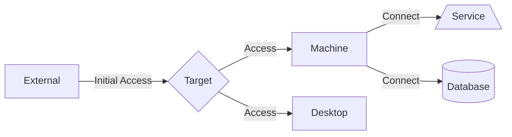

# Diagram

## Mermaid.js

> https://github.com/mermaid-js/mermaid-cli

Resources:
- https://mermaid.live/
- https://mermaid-js.github.io/mermaid/#/
- https://developpaper.com/how-to-get-started-with-writing/
- https://github.blog/2022-02-14-include-diagrams-markdown-files-mermaid/
